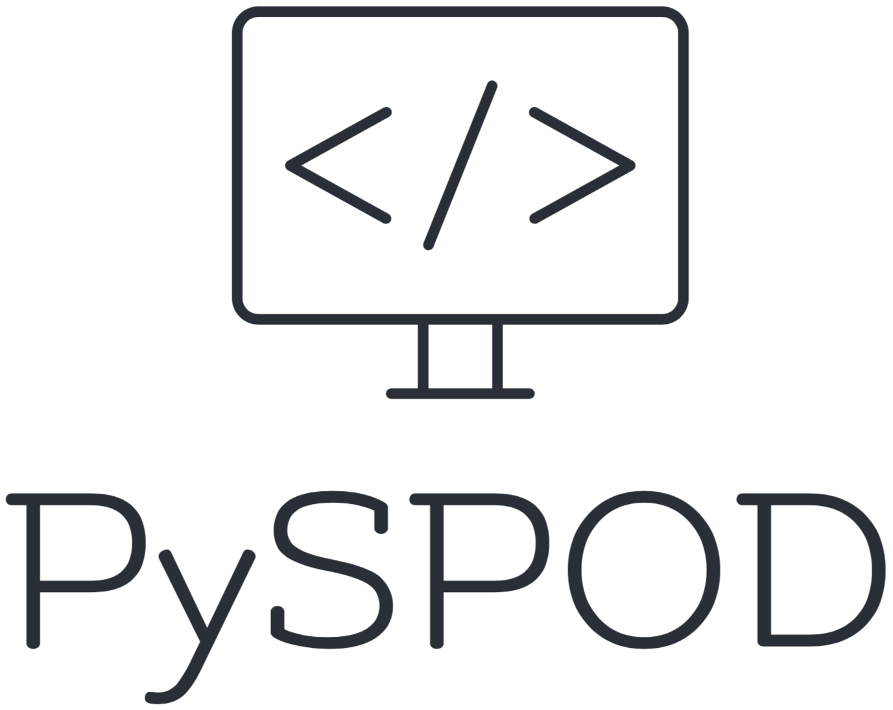

<p align="center">
  <a href="http://MathEXLab.github.io/PySPOD/" target="_blank" >
    
  </a>
</p>

<p align="center">
  <a href="https://doi.org/10.21105/joss.02862" target="_blank">
    
  </a>

  <a href="https://github.com/MathEXLab.github.io/PySPOD/LICENSE" target="_blank">
    
  </a>

  <a href="https://badge.fury.io/py/pyspod">
    
  </a>

  <a href="https://github.com/MathEXLab/PySPOD/actions/workflows/continuous-integration.yml" target="_blank">
    	  
  </a>

  <a href="https://codecov.io/gh/MathEXLab/PySPOD" > 
     
  </a>

  <a href="https://www.codacy.com?utm_source=github.com&amp;utm_medium=referral&amp;utm_content=MathEXLab.github.io/PySPOD&amp;utm_campaign=Badge_Grade">
    
  </a>
</p>

# *PySPOD*: A parallel (distributed) Python SPOD package

## What do we implement?

In this package we implement two versions of SPOD, both available as **parallel and distributed** (i.e. they can run on multiple cores/nodes on large-scale HPC machines) via [mpi4py](https://github.com/mpi4py/mpi4py): 

  - **spod_standard**: this is the **batch** algorithm as described in [(Schmidt and Towne, 2019)](https://doi.org/10.1017/jfm.2018.283).
  - **spod_streaming**: that is the **streaming** algorithm presented in [(Schmidt and Towne, 2019)](https://doi.org/10.1017/jfm.2018.283).

We additionally implement the calculation of time coefficients and the reconstruction of the data, given a set of modes $\phi$ and coefficients *a*, as explained in [(Chu and Schmidt, 2021)](10.1007/s00162-021-00588-6) and [(Nekkanti and Schmidt, 2021)](https://doi.org/10.1017/jfm.2021.681). The library comes with a package to emulating the reduced space, that is to forecasting the time coefficients using neural networks, as described in [Lario et al., 2022](https://doi.org/10.1016/j.jcp.2022.111475).

To see how to use the **PySPOD** package, you can look at the [**Tutorials**](tutorials/README.md).

For additional information, you can also consult the PySPOD website: [**https://mathe-lab.github.io/PySPOD/**](https://mathe-lab.github.io/PySPOD/).

## How to cite this work
Current reference to the PySPOD library is:  

```bash
@article{mengaldo2021pyspod,
  title={Pyspod: A python package for spectral proper orthogonal decomposition (spod)}
  author={Mengaldo, Gianmarco and Maulik, Romit},
  journal={Journal of Open Source Software},
  volume={6},
  number={60},
  pages={2862},
  year={2021}
}
```

## What data can we apply SPOD to?

SPOD can be applied to **wide-sense stationary data**. Examples of these arise in different fields, including **fluidmechanics**, and **weather** and **climate**, among others. 

## How do I install the library?

If you want to download and install the latest version from `main`:
- download the library
- from the top directory of PySPOD, type

```bash
python3 setup.py install
```

> To allow for parallel capabilities, you need to have installed an MPI distribution in your machine. Currently MPI distributions tested are [Open MPI](https://www.open-mpi.org), and [Mpich](https://www.mpich.org). Note that the library will still work in **serial** (no parallel capabilities), if you **do not have MPI**.


## Recent works with **PySPOD**

Please, [contact me](mailto:gianmarco.mengaldo@gmail.com) if you used PySPOD for a publication and you want it to be advertised here.

- A. Lario, R. Maulik, G. Rozza, G. Mengaldo, [Neural-Network learning of SPOD latent space]([https://arxiv.org/abs/2110.09218](https://doi.org/10.1016/j.jcp.2022.111475))

## Authors and contributors

**PySPOD** is currently developed and mantained by

  * [G. Mengaldo](mailto:mpegim@nus.edu.sg), National University of Singapore (Singapore).

Current active contributors include:

  * [M. Rogowski](https://mrogowski.github.io), King Abdullah University of Science and Technology (Saudi Arabia).
  * [L. Dalcin](https://cemse.kaust.edu.sa/ecrc/people/person/lisandro-dalcin), King Abdullah University of Science and Technology (Saudi Arabia).
  * [R. Maulik](https://romit-maulik.github.io), Argonne National Laboratory (US).
  * [A. Lario](https://www.math.sissa.it/users/andrea-lario), SISSA (Italy)

## How to contribute

Contributions improving code and documentation, as well as suggestions about new features are more than welcome!

The guidelines to contribute are as follows:
1. open a new issue describing the bug you intend to fix or the feature you want to add.
2. fork the project and open your own branch related to the issue you just opened, and call the branch `fix/name-of-the-issue` if it is a bug fix, or `feature/name-of-the-issue` if you are adding a feature.
3. ensure to use 4 spaces for formatting the code.
4. if you add a feature, it should be accompanied by relevant tests to ensure it functions correctly, while the code continue to be developed.
5. commit your changes with a self-explanatory commit message.
6. push your commits and submit a pull request. Please, remember to rebase properly in order to maintain a clean, linear git history.

[Contact us](mailto:mpegim@nus.edu.sg) by email for further information or questions about **PySPOD** or ways on how to contribute.


## License

See the [LICENSE](LICENSE.rst) file for license rights and limitations (MIT).
