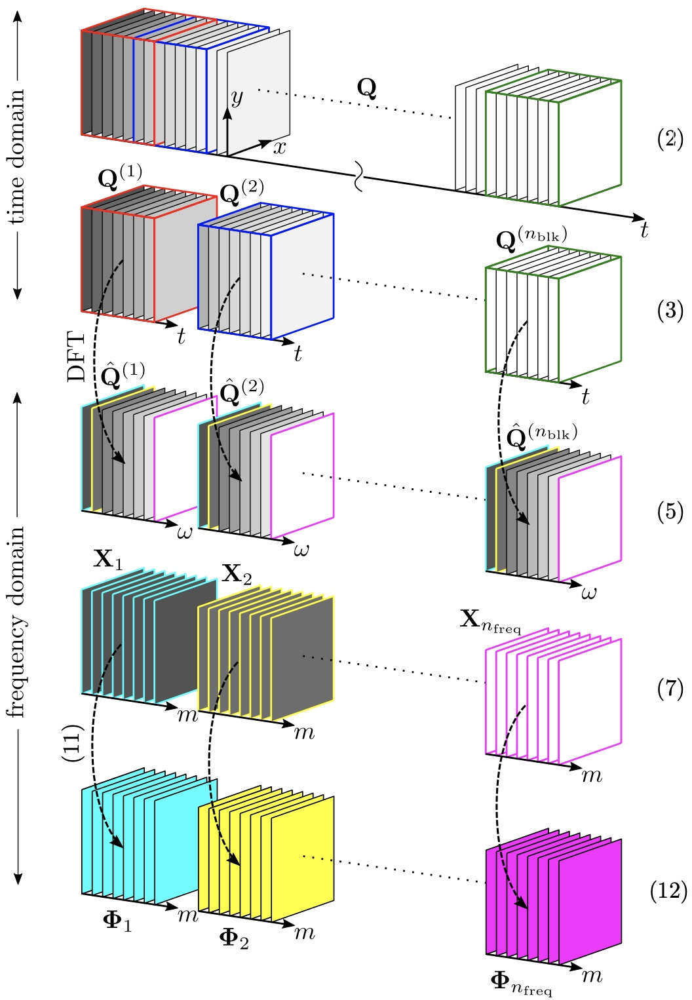
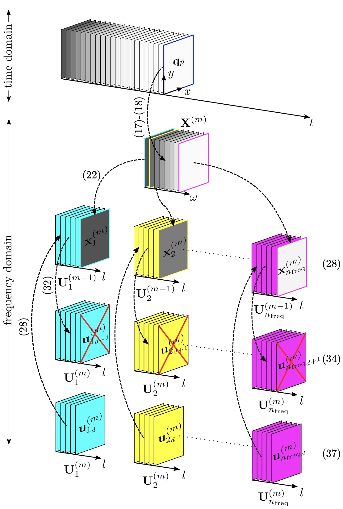

## What do we implement?

**PySPOD** is a Python package that implements the so-called
**Spectral Proper Orthgonal Decomposition**.

We implement two versions of SPOD, both available as **parallel (distributed)**
(i.e. they can run on multiple cores/nodes on large-scale HPC machines)
via [mpi4py](https://github.com/mpi4py/mpi4py):

  - **spod_standard**: this is the **batch** algorithm as described
    in [Towne 2018](https://doi.org/10.1017/jfm.2018.283)
    |{:width="30%"}|
    |Batch algorithm. Figure from [Schmidt and Towne 2019](https://doi.org/10.1016/j.cpc.2018.11.009).|
  - **spod_streaming**: that is the **streaming** algorithm presented
    in [Schmidt and Towne 2019](https://doi.org/10.1016/j.cpc.2018.11.009).
    |{:width="30%"}|
    |Streaming algorithm. Figure from [Schmidt and Towne 2019](https://doi.org/10.1016/j.cpc.2018.11.009).|

We additionally implement the calculation of time coefficients
and the reconstruction of the solution, given a set of modes
$\phi$ and coefficients _a_, as explained in e.g.,
[Lario et al. 2022](https://www.sciencedirect.com/science/article/pii/S002199912200537X).

To see how to use the **PySPOD** package, you can look at the
[**Tutorials**](./tutorials).

## What data can we apply SPOD to?

SPOD can be applied to wide-sense stationary data, that is ergodic
processes. Examples of these arise in different fields, including
fluidmechanics, and weather and climate, among others. An example
of ergodic data can be found in [**Tutorial 1**](./tutorials/tutorial1).

## What is SPOD?

**Spectral Proper Orthgonal Decomposition (SPOD)** is a modal analysis tool
[Taira et al 2017](https://doi.org/10.2514/1.J056060), that allows extracting
spatio-temporal coherent patterns in ergodic data. Its name, SPOD, was first
conied by
[Picard and Delville 2000](https://www.sciencedirect.com/science/article/abs/pii/S0142727X00000217),
and goes back to the original work by
[Lumley 1970](https://www.elsevier.com/books/stochastic-tools-in-turbulence/lumey/978-0-12-395772-6?aaref=https%3A%2F%2Fwww.google.com).
SPOD has been extensively used in the past few years to identify spatio-temporal
coherent patterns in a variety of datasets, mainly in the fluidmechanics and
climate communities. In fluidmechanics it was applied to jets
[Schmidt et al. 2017](https://doi.org/10.1017/jfm.2017.407),
wakes [Araya et al. 2017](https://doi.org/10.1017/jfm.2016.862), and boundary
layers [Tutkun and George 2017](https://aip.scitation.org/doi/10.1063/1.4974746),
among others, while in weather and climate it was applied to ECMWF reanalysis
datasets under the name Spectral Empirical Orthogonal Function, or SEOF,
[Schmidt et al. 2019](https://doi.org/10.1175/MWR-D-18-0337.1),
[Lario et al. 2022](https://www.sciencedirect.com/science/article/pii/S002199912200537X).

The SPOD approach targets statistically stationary problems and involves
the decomposition of the cross-spectral density tensor. This means that
the SPOD leads to a set of spatial modes that oscillate in time at a single
frequency and that optimally capture the variance of an ensemble of stochastic
data [Towne et al. 2018](https://doi.org/10.1017/jfm.2018.283). Therefore,
given a dataset that is statistically stationary, one is able to capture
the optimal spatio-temporal coherent structures that explain the variance
in the dataset.

This can help identifying relations to multiple variables or understanding
the reduced order behavior of a given phenomenon of interest and represent
a powerful tool for the data-driven analysis of nonlinear dynamical systems.
The SPOD approach shares some relationships with the dynamic mode decomposition
(DMD), and the resolvent analysis,
[Towne et al. 2018](https://doi.org/10.1017/jfm.2018.283), that are also widely
used approaches for the data-driven analysis of nonlinear systems. SPOD can
be used for both experimental and simulation data, and a general description
of its key parameters can be found in
[(Schmidt and Colonius 2020)](https://doi.org/10.2514/1.J058809).

In PySPOD, we implement two versions, the so-called batch algorithm
[Towne 2018](https://doi.org/10.1017/jfm.2018.283), and the
streaming algorithms
[Schmidt and Towne 2019](https://doi.org/10.1016/j.cpc.2018.11.009).

Both are based on their Matlab implementation counterpart:
- [batch_spod_matlab](https://github.com/SpectralPOD/spod_matlab)
- [streaming_spod_matlab](https://nl.mathworks.com/matlabcentral/fileexchange/69963-streaming-spectral-proper-orthogonal-decomposition)

[Go to the Home Page]({{ '/' | absolute_url }})
