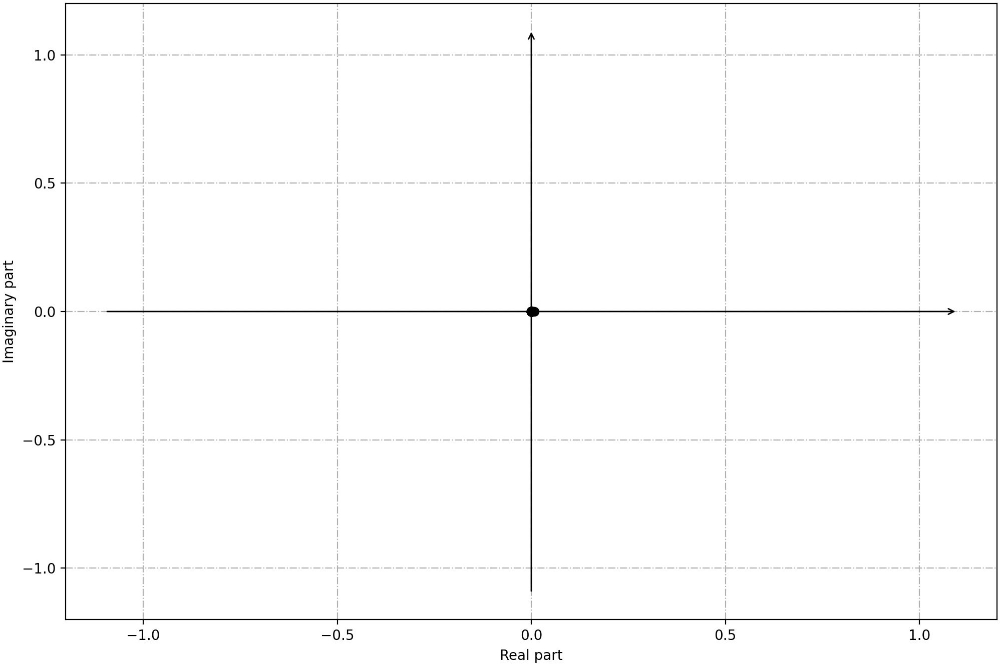
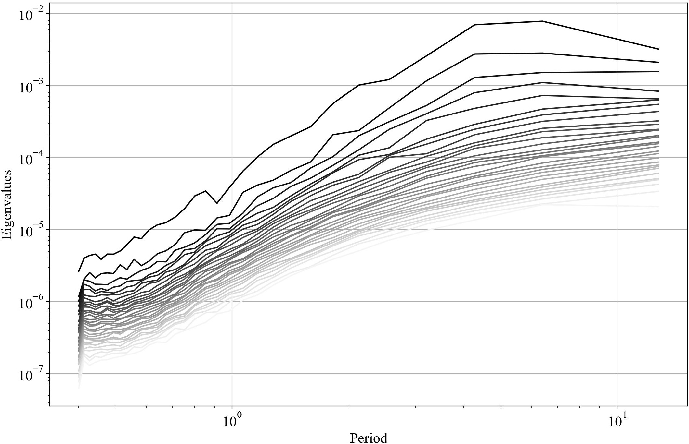
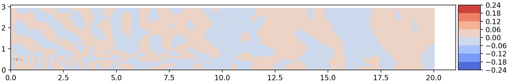
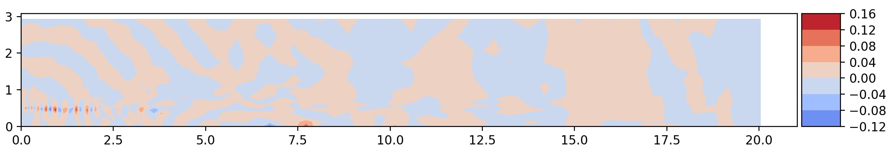
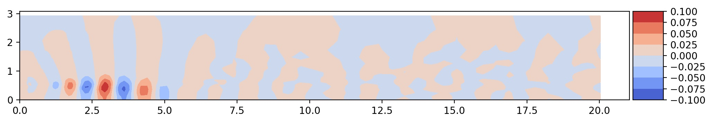
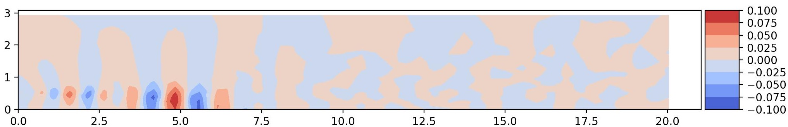
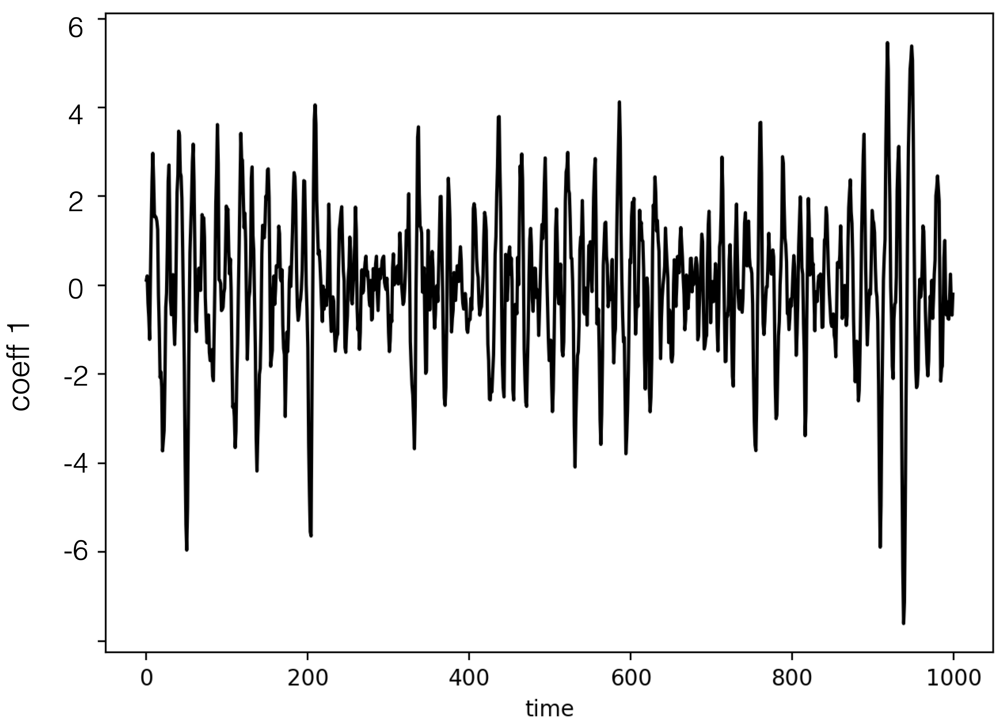
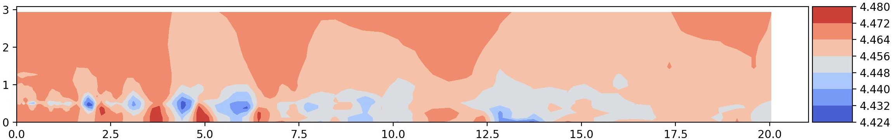
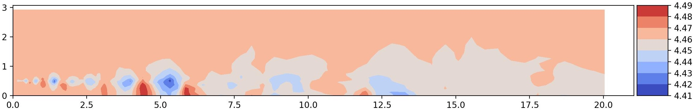
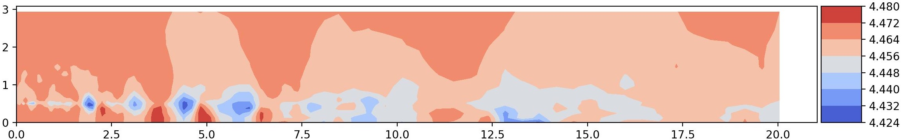

## Preliminaries

For this tutorial:

- The data can be found here [fluidmechanics_data.mat](https://github.com/mathe-lab/PySPOD/blob/7ec12b3b6e79e162acb2c79a79ef7eb78ec5a769/tests/data/fluidmechanics_data.mat)
- The configuration file here [input_tutorial1.yaml](https://github.com/mathe-lab/PySPOD/blob/7ec12b3b6e79e162acb2c79a79ef7eb78ec5a769/tests/data/input_tutorial1.yaml)
- The complete Python script here [tutorial1.py](https://github.com/mathe-lab/PySPOD/blob/7ec12b3b6e79e162acb2c79a79ef7eb78ec5a769/tutorials/tutorial1/tutorial1.py)


## Description

In this tutorial we explore a small dataset provided with this package
that contains the flow exiting a nozzle (also referred to as a jet) 
from [Bres et al.](https://www.cambridge.org/core/journals/journal-of-fluid-mechanics/article/abs/importance-of-the-nozzleexit-boundarylayer-state-in-subsonic-turbulent-jets/1202408D48E0FC3CB31BC9E9D7DE3BD4).
The data is the symmetric component of a three-dimensional jet, 
and therefore itself two-dimensional. It is provided in equally-spaced
cylindrical coordinates _(r,x)_. 

Starting from this dataset, we show how to:

1. load the required libraries, data and parameters,
2. extract the SPOD modes,
3. compute the time coefficients, by projecting the
data on the SPOD basis built by gathering the modes, and
4. reconstruct the high-dimensional data from the coefficients

In detail, the dataset consists of 1000 flow realizations
which represent the pressure field at different time instants.
The time step is 0.01 seconds.

||
|:--:|
|<span style="color:#858986;"> **Animation of the data used in this tutorial.**</span>|


## 1. Load libraries, data and parameters

The dataset is part of the data used for the regression tests that come
with this library and is stored into `tests/data/fluidmechanics_data.mat`.
The first step to analyze this dataset is to import the required libraries,
including the custom libraries

```python
import numpy as np
from pyspod.spod.standard  import Standard  as spod_standard
from pyspod.spod.streaming import Streaming as spod_streaming
```

The second step consists of loading the data from the `fluidmechanics_data.mat`.
To this end, we provide a reader that accept `.nc`, `.npy`, and `.mat` formats.

```python
data_file = os.path.join(CFD,'./data', 'fluidmechanics_data.mat')
data_dict = utils_io.read_data(data_file=data_file)
data = data_dict['p'].T
dt = data_dict['dt'][0,0]
nt = data.shape[0]
x1 = data_dict['r'].T; x1 = x1[:,0]
x2 = data_dict['x'].T; x2 = x2[0,:]
```

The third step is to read the parameters, that should be provided
in Python dictionary format. We conveniently provide a yaml configuration
file reader tailored to PySPOD.

```python
config_file = os.path.join(CFD, 'data', 'input_tutorial1.yaml')
params = utils_io.read_config(config_file)
```

We can override some parameters in the dictionary in case it is needed.
In this tutorial, we want to set the time step from the data we loaded,
so, we write

```python
params['time_step'] = dt
```

where `dt` has been previously defined when loadin the data.

## 2. Compute SPOD modes and visualize useful quantities

### 2.1 Computation SPOD modes
We can now run the PySPOD library on our data to obtain the SPOD
modes. This is done by initializing the class and running the
fit method:

```python
standard = spod_standard(params=params, comm=comm)
spod = standard.fit(data_list=data)
```

where `params`, `comm`, and `data` have all been defined above.
The `spod_standard` class implements the SPOD batch algorithm,
as described in [About](./about). We can alternatively choose
the streaming algorithm, by writing

```python
streaming = spod_streaming(params=params, comm=comm)
spod = streaming.fit(data_list=data)
```

After computing the SPOD modes, we can check their orthogonality,
to make sure that the run went well

```python
results_dir = spod.savedir_sim
flag, ortho = utils_spod.check_orthogonality(
    results_dir=results_dir, mode_idx1=[1],
    mode_idx2=[0], freq_idx=[5], dtype='double',
    comm=comm)
```

where we retrieved the path where the SPOD modes were saved, using
`results_dir = spod.savedir_sim`. The above orthogonality check,
for the modes considered, should return: `flag = True`, and `ortho < 1e-15`
(i.e., the mode 1 and mode 0 for frequency id 5, are orthogonal as expected).

### 2.2 Visualization

PySPOD comes with some useful postprocessing routines.
These can for instance visualize:

- the eigenvalues, and the eigenvalues vs period (and frequency),
```python
if rank == 0:
    spod.plot_eigs(filename='eigs.jpg')
    spod.plot_eigs_vs_period(filename='eigs_period.jpg')
```

 | 
:-------------------------:|:-------------------------:
<span style="color:#858986;"> **Eigenvalues**</span> | <span style="color:#858986;"> **Eigenvalues vs period**</span>

<br/>

- the SPOD modes for different frequencies
```python
## identify frequency of interest
T1 = 0.9; T2 = 4
f1, f1_idx = spod.find_nearest_freq(freq_req=1/T1, freq=spod.freq)
f2, f2_idx = spod.find_nearest_freq(freq_req=1/T2, freq=spod.freq)
if rank == 0:
    ## plot 2d modes at frequency of interest
    spod.plot_2d_modes_at_frequency(freq_req=f1, freq=spod.freq,
        modes_idx=[0,1,2], x1=x2, x2=x1, equal_axes=True,
        filename='modes_f1.jpg')

    ## plot 2d modes at frequency of interest
    spod.plot_2d_modes_at_frequency(freq_req=f2, freq=spod.freq,
        modes_idx=[0,1,2], x1=x2, x2=x1, equal_axes=True,
        filename='modes_f2.jpg')
```

 | 
:-------------------------:|:-------------------------:
<span style="color:#858986;"> **Mode 0, Period = 0.85**</span> | <span style="color:#858986;"> **Mode 1, Period = 0.85**</span>

 | 
:-------------------------:|:-------------------------:
<span style="color:#858986;"> **Mode 0, Period = 4**</span> | <span style="color:#858986;"> **Mode 1, Period = 4**</span>

> Note that we are performing these visualization steps in rank = 0, only.


## 3. Approximate time-dependent coefficients via oblique projection

We can then compute the time coefficients and reconstruct the
high-dimensional solution using a reduced set of them, and the
associated SPOD modes. The method used here is the one referred to as oblique projection by [Nekkanti and Schmidt](https://www.cambridge.org/core/journals/journal-of-fluid-mechanics/article/frequencytime-analysis-lowrank-reconstruction-and-denoising-of-turbulent-flows-using-spod/185209DE4D89853B8F3F2D4B9305EFDD).

These two steps can be achieved as follows

```python
file_coeffs, coeffs_dir = utils_spod.compute_coeffs(
    data=data, results_dir=results_dir, comm=comm)
```

where we retrieved the path where the SPOD modes were saved,
using the previously ran command `results_dir = spod.savedir_sim`.

We can visualize them as follows
```python
coeffs = np.load(file_coeffs)
post.plot_coeffs(coeffs, coeffs_idx=[0,1], path=results_dir,
    filename='coeffs.jpg')
```

 | 
:-------------------------:|:-------------------------:
<span style="color:#858986;"> **Coefficient 0**</span> | <span style="color:#858986;"> **Coefficient 1**</span>


## 4. Reconstruct high-dimensional data

We can finally reconstruct the high-dimensional data using the
SPOD modes and time coefficients computed in the previous steps.
This can be achieved as follows

```python
file_dynamics, coeffs_dir = utils_spod.compute_reconstruction(
    coeffs_dir=coeffs_dir, time_idx='all', comm=comm)
```    

where we retrieved the path where the SPOD coefficients were saved,
using `coeffs_dir`, that was given when computing the coefficient
in the previous step.

> The argument `time_idx` can be chosen to reconstruct only some
time snapshots (by specifying a list of ids) instead of the entire solution.  

Also in this case, we can visualize the reconstructed solution,
and compare it against the original data. Below, we compare time
ids 0, and 10:

```python
## plot reconstruction
recons = np.load(file_dynamics)
post.plot_2d_data(recons, time_idx=[0,10], filename='recons.jpg',
    path=results_dir, x1=x2, x2=x1, equal_axes=True)

## plot data
data = spod.get_data(data)
post.plot_2d_data(data, time_idx=[0,10], filename='data.jpg',
    path=results_dir, x1=x2, x2=x1, equal_axes=True)
```

 | 
 | 
:-------------------------:|:-------------------------:
<span style="color:#858986;"> **Time id 0**: true data (top); reconstructed data (bottom)</span> | <span style="color:#858986;"> **Time id 1**: true data (top); reconstructed data (bottom)**</span>


[Go to the Home Page]({{ '/' | absolute_url }})
