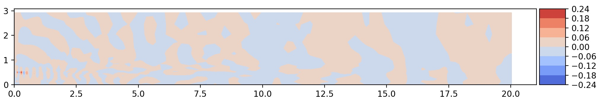

## Description

In this tutorial we explore a small dataset provided with this package
that contains pressure data of the flow exiting a nozzle (also referred
to as a jet). Cylindrical coordinates _(r,x)_ are used and they are equally
spaced. In particular, starting from a database of pre computed solutions,
we want to:

- extract the SPOD (coherent in space and time) modes,
- compute the coefficients, by projecting the data on
the SPOD basis built by gathering the modes, and
- reconstruct the high-dimensional data from the coefficients

In detail, the starting dataset consists of 1000 flow realizations which
represent the pressure field at different time instants. The time step
is 12 hours.

||
|:--:|
|<span style="color:#858986;"> **Animation of the data used in this tutorial.**</span>|


## Loading libraries, data and parameters

The dataset is part of the data used for the regression tests that come
with this library and is stored into `tests/data/fluidmechanics_data.mat`.
The first step to analyze this dataset is to import the required libraries,
including the custom libraries

```python
import numpy as np
from pyspod.spod.standard  import Standard  as spod_standard
from pyspod.spod.streaming import Streaming as spod_streaming
```

The second step consists of loading the data from the `fluidmechanics_data.mat`.
To this end, we provide a reader that accept `.nc`, `.npy`, and `.mat` formats.

```python
data_file = os.path.join(CFD,'./data', 'fluidmechanics_data.mat')
data_dict = utils_io.read_data(data_file=data_file)
data = data_dict['p'].T
dt = data_dict['dt'][0,0]
nt = data.shape[0]
x1 = data_dict['r'].T; x1 = x1[:,0]
x2 = data_dict['x'].T; x2 = x2[0,:]
```

The third step is to read the parameters, that are should be provided
in Python dictionary format. We conveniently provide a yaml configuration
file reader tailored to PySPOD.

```python
config_file = os.path.join(CFD, 'data', 'input_spod.yaml')
params = utils_io.read_config(config_file)
```

We can override some parameters in the dictionary in case it is needed.
In this tutorial, we want to set the time step from the data we loaded,
so, we write

```python
params['time_step'] = dt
```

where `dt` has been previously defined when loadin the data.

## Computing SPOD modes and visualizing useful quantities

### Computing SPOD modes
We can now run the PySPOD library on our data to obtain the SPOD modes.
This is done by initializing the class and running the fit method:

```python
standard = spod_standard(params=params, comm=comm)
spod = standard.fit(data=data, nt=nt)
```

where `params`, `comm`, `data`, and `nt` have all been defined above.
The `spod_standard` class implements the SPOD batch algorithm, as described
in [About](./about). We can alternatively choose the streaming algorithm,
by writing

```python
streaming = spod_streaming(params=params, comm=comm)
spod = streaming.fit(data=data, nt=nt)
```

After computing the SPOD modes, we can check their orthogonality,
to make sure that the run went well

```python
results_dir = spod.savedir_sim
flag, ortho = utils_spod.check_orthogonality(
    results_dir=results_dir, mode_idx1=[1],
    mode_idx2=[0], freq_idx=[5], dtype='double',
    comm=comm)
```

where we retrieved the path where the SPOD modes were saved, using
`results_dir = spod.savedir_sim`. The above orthogonality check,
for the modes considered, should return: `flag = True`, and `ortho < 1e-15`
(i.e., the mode 1 and mode 0 for frequency id 5, are orthogonal as expected).

### Visualization

PySPOD comes with some useful postprocessing routines.
These can for instance visualize:

- the eigenvalues, and the eigenvalues vs period (and frequency),
```python
if rank == 0:
    spod.plot_eigs(filename='eigs.png')
    spod.plot_eigs_vs_period(filename='eigs_period.png')
```

 | 
:-------------------------:|:-------------------------:
<span style="color:#858986;"> **Eigenvalues**</span> | <span style="color:#858986;"> **Eigenvalues vs period**</span>

<br/><br/>

- the SPOD modes for different frequencies
```python
## identify frequency of interest
T1 = 0.9; T2 = 4
f1, f1_idx = spod.find_nearest_freq(freq_req=1/T1, freq=spod.freq)
f2, f2_idx = spod.find_nearest_freq(freq_req=1/T2, freq=spod.freq)
if rank == 0:
    ## plot 2d modes at frequency of interest
    spod.plot_2d_modes_at_frequency(freq_req=f1, freq=spod.freq,
        modes_idx=[0,1,2], x1=x2, x2=x1, equal_axes=True,
        filename='modes_f1.png')

    ## plot 2d modes at frequency of interest
    spod.plot_2d_modes_at_frequency(freq_req=f2, freq=spod.freq,
        modes_idx=[0,1,2], x1=x2, x2=x1, equal_axes=True,
        filename='modes_f2.png')
```

 | 
:-------------------------:|:-------------------------:
<span style="color:#858986;"> **Mode 0, Period = 0.85**</span> | <span style="color:#858986;"> **Mode 1, Period = 0.85**</span>

 | 
:-------------------------:|:-------------------------:
<span style="color:#858986;"> **Mode 0, Period = 4**</span> | <span style="color:#858986;"> **Mode 1, Period = 4**</span>

> Note that we are performing these visualization steps in rank = 0, only.


## Computing time coefficients and reconstructing the high-dimensional solution

We can finally compute the time coefficients and reconstruct the
high-dimensional solution using a reduced set of them, and the
associated SPOD modes.

These two steps can be achieved as follows

```python
file_coeffs, coeffs_dir = utils_spod.compute_coeffs(
    data=data, results_dir=results_dir, comm=comm)

file_dynamics, coeffs_dir = utils_spod.compute_reconstruction(
    coeffs_dir=coeffs_dir, time_idx='all', comm=comm)
```    

where we retrieved the path where the SPOD modes were saved,
using the previously ran command `results_dir = spod.savedir_sim`.


[Go to the Home Page]({{ '/' | absolute_url }})
