## Preliminaries

For this tutorial:

- The data can be found here [era_interim_data.nc]()
- The complete Python script here [tutorial2.py]()
- The configuration file here [input_tutorial2.yaml]()

## Description

In this tutorial we explore a reanalysis dataset provided with this package
that contains total precipitation data over Earth. The data is two-dimensional
on a longitude-latitude grid, and is part of the ERA Interim dataset provided
by ECMWF (please, refer to [ERA Interim](https://www.ecmwf.int/en/forecasts/datasets/reanalysis-datasets/era-interim)
for more details). The dataset was reduced to include only the period 2008-2017,
on a longitude-latitude grid that was also downsampled by a factor 5.

Starting from this dataset, we show how to:

1. load the required libraries, data and parameters,
2. extract the SPOD modes,
3. compute the time coefficients, by projecting the
data on the SPOD basis built by gathering the modes, and
4. reconstruct the high-dimensional data from the coefficients

In detail, the dataset consists of 7305 time snapshots which
represent the total precipitation field at different time instants.
The time step is 12 hours, and it is sampled every day, in the period
2008 to 2017 at 03:00, and 15:00.

||
|:--:|
|<span style="color:#858986;"> Animation of the **total precipitation** field data used in this tutorial.</span>|


## 1. Load libraries, data and parameters

The dataset is part of the data used for the regression tests that come
with this library and is stored into `tests/data/era_interim_data.nc`.
The first step to analyze this dataset is to import the required libraries,
including the custom libraries

```python
import numpy as np
from pyspod.spod.standard  import Standard  as spod_standard
from pyspod.spod.streaming import Streaming as spod_streaming
```

The second step consists of loading the data from the `era_interim_data.nc`.
To this end, we provide a reader that accept `.nc`, `.npy`, and `.mat` formats.

```python
data_file = os.path.join(CFD, './data/', 'era_interim_data.nc')
ds = utils_io.read_data(data_file=data_file)
t = np.array(ds['time'])
x1 = np.array(ds['longitude']) - 180
x2 = np.array(ds['latitude'])
data = ds['tp']
nt = len(t)
```

The third step is to read the parameters, that should be provided
in Python dictionary format. We conveniently provide a yaml configuration
file reader tailored to PySPOD.

```python
config_file = os.path.join(CFD, 'data', 'input_tutorial2.yaml')
params = utils_io.read_config(config_file)
```

Given that the grid points of our data are not equi-spaced, we need to
compute the weights. We provide a conveniently pre-implemented version
of 2D trapezoidal weights that can be used for this case, and that can
be used as follows:

```python
## set weights
weights = utils_weights.geo_trapz_2D(
    x1_dim=x2.shape[0], x2_dim=x1.shape[0],
    n_vars=params['n_variables'])
```


## 2. Compute SPOD modes and visualize useful quantities

### 2.1 Computation SPOD modes
We can now run the PySPOD library on our data to obtain the SPOD modes.
This is done by initializing the class and running the fit method:

```python
standard = spod_standard (params=params, weights=weights, comm=comm)
spod = standard.fit(data_list=data)
```

where `params`, `comm`, `weights` and `data`, have all been defined above.
The `spod_standard` class implements the SPOD batch algorithm, as described
in [About](./about). We can alternatively choose the streaming algorithm,
by writing

```python
streaming = spod_streaming(params=params, weights=weights, comm=comm)
spod = streaming.fit(data=data, nt=nt)
```

After computing the SPOD modes, we can check their orthogonality,
to make sure that the run went well

```python
results_dir = spod.savedir_sim
flag, ortho = utils_spod.check_orthogonality(
    results_dir=results_dir, mode_idx1=[1],
    mode_idx2=[0], freq_idx=[5], dtype='double',
    comm=comm)
```

where we retrieved the path where the SPOD modes were saved, using
`results_dir = spod.savedir_sim`. The above orthogonality check,
for the modes considered, should return: `flag = True`, and `ortho < 1e-15`
(i.e., the mode 1 and mode 0 for frequency id 5, are orthogonal as expected).

### 2.2 Visualization

PySPOD comes with some useful postprocessing routines.
These can for instance visualize:

- the eigenvalues, and the eigenvalues vs period (and frequency),
```python
if rank == 0:
    spod.plot_eigs(filename='eigs.jpg')
    spod.plot_eigs_vs_period(filename='eigs_period.jpg')
```

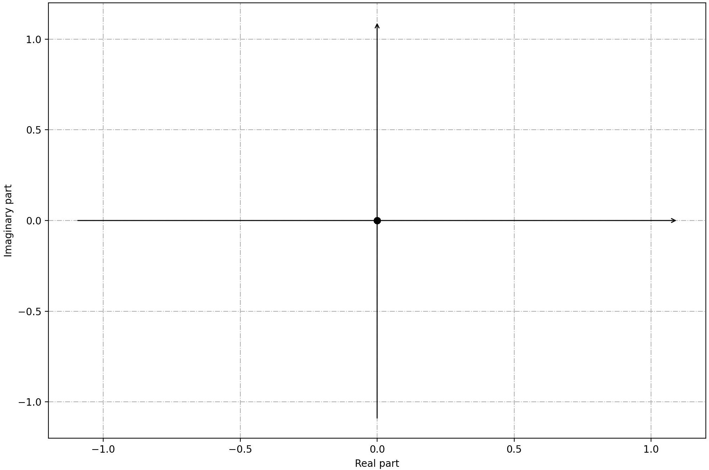 | 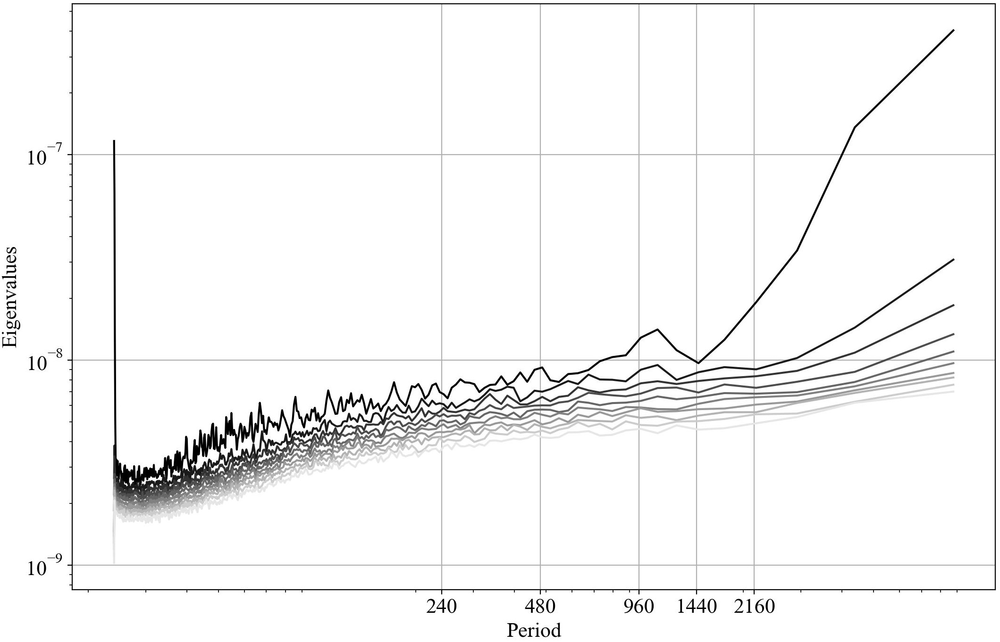
:-------------------------:|:-------------------------:
<span style="color:#858986;"> **Eigenvalues**</span> | <span style="color:#858986;"> **Eigenvalues vs period**</span>

In the right figure, we can see that there is a peak at around 40 days
(960 hours). This is approximately the average period of the Madden-Julian
Oscillation, or MJO. The MJO is an intraseasonal phenomenon that characterizes
the tropical atmosphere. Its characteristic period varies between 30 and
90 days and it is due to a coupling between large-scale atmospheric circulation
and deep convection. This pattern slowly propagates eastward with a speed of
4 to 8 $ms^{−1}$. MJO is a rather irregular phenomenon and this implies that
the MJO can be seen at a large-scale level as a mix of multiple high-frequency,
small-scale convective phenomena.  
<br/>

- the SPOD modes for different frequencies
```python
## identify frequency of interest
T1 = 960; T2 = 1008
f1, f1_idx = spod.find_nearest_freq(freq_req=1/T1, freq=spod.freq)
f2, f2_idx = spod.find_nearest_freq(freq_req=1/T2, freq=spod.freq)
if rank == 0:
    ## plot 2d modes at frequency of interest
    spod.plot_2d_modes_at_frequency(freq_req=f1, freq=spod.freq,
        modes_idx=[0,1,2], x1=x2, x2=x1, equal_axes=True,
        filename='modes_f1.jpg')

    ## plot 2d modes at frequency of interest
    spod.plot_2d_modes_at_frequency(freq_req=f2, freq=spod.freq,
        modes_idx=[0,1,2], x1=x2, x2=x1, equal_axes=True,
        filename='modes_f2.jpg')
```

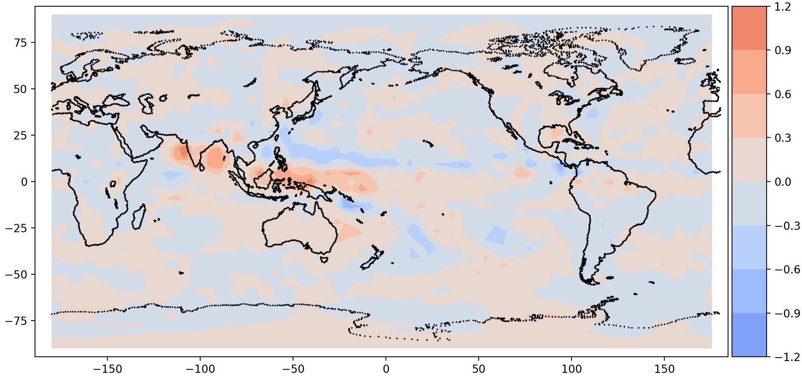 | 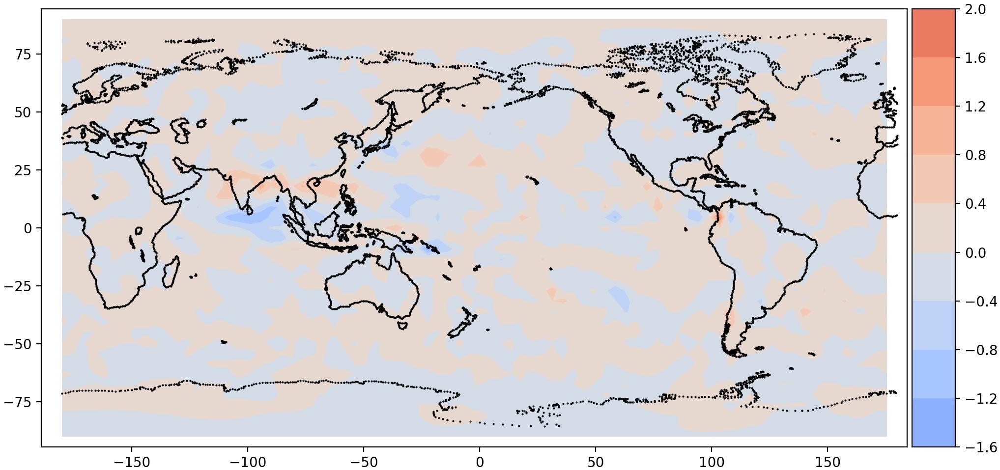
:-------------------------:|:-------------------------:
<span style="color:#858986;"> **Mode 0, Period = 960**</span> | <span style="color:#858986;"> **Mode 1, Period = 960**</span>

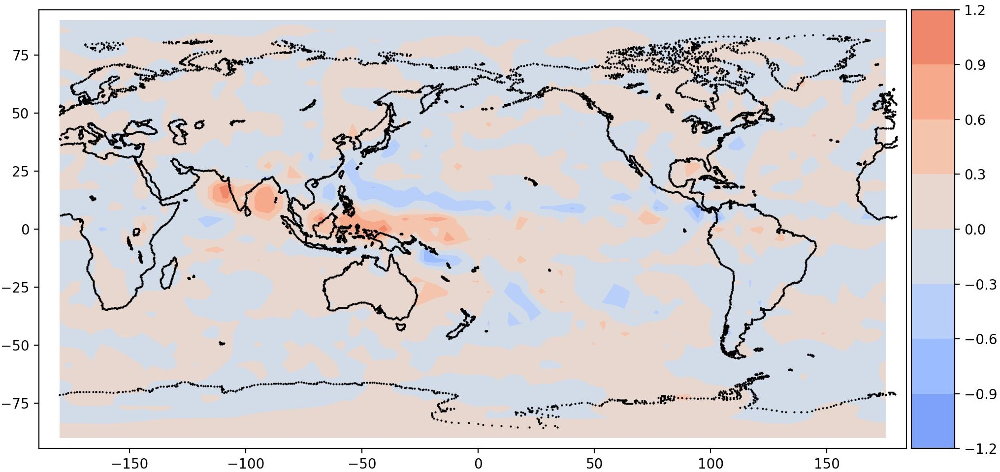 | 
:-------------------------:|:-------------------------:
<span style="color:#858986;"> **Mode 0, Period = 1008**</span> | <span style="color:#858986;"> **Mode 1, Period = 1008**</span>

It is interesting to note a total precipitation pattern in South East Asia,
as expected. This is the signature of MJO. It should be noted that the data
is very coarse, hence the resolution is also coarse.


> Note that we are performing these visualization steps in rank = 0, only.


## 3. Compute time coefficients

We can then compute the time coefficients and reconstruct the
high-dimensional solution using a reduced set of them, and the
associated SPOD modes.

These two steps can be achieved as follows

```python
file_coeffs, coeffs_dir = utils_spod.compute_coeffs(
    data=data, results_dir=results_dir, comm=comm)
```

where we retrieved the path where the SPOD modes were saved,
using the previously ran command `results_dir = spod.savedir_sim`.

We can visualize them as follows
```python
coeffs = np.load(file_coeffs)
post.plot_coeffs(coeffs, coeffs_idx=[0,1], path=results_dir,
    filename='coeffs.jpg')
```

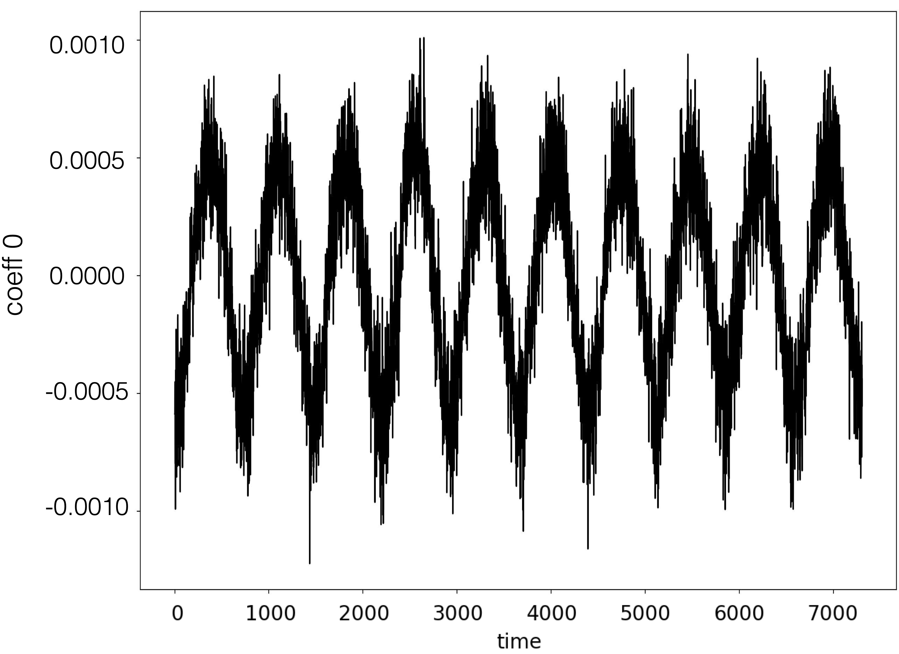 | 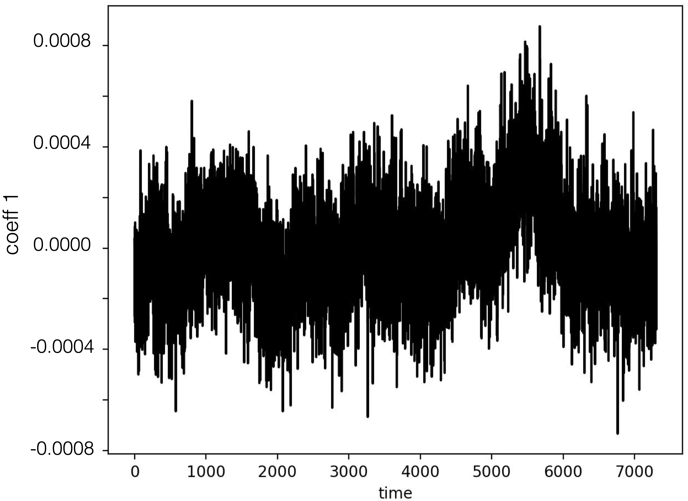
:-------------------------:|:-------------------------:
<span style="color:#858986;"> **Coefficient 0**</span> | <span style="color:#858986;"> **Coefficient 1**</span>

> Note that this step may require some time.

## 4. Reconstruct high-dimensional data

We can finally reconstruct the high-dimensional data using the
SPOD modes and time coefficients computed in the previous steps.
This can be achieved as follows

```python
file_dynamics, coeffs_dir = utils_spod.compute_reconstruction(
    coeffs_dir=coeffs_dir, time_idx='all', comm=comm)
```    

where we retrieved the path where the SPOD coefficients were saved,
using `coeffs_dir`, that was given when computing the coefficient
in the previous step.

> The argument `time_idx` can be chosen to reconstruct only some
time snapshots (by specifying a list of ids) instead of the entire solution.  

Also in this case, we can visualize the reconstructed solution, and compare
it against the original data. Below, we compare time ids 0, and 10:

```python
## plot reconstruction
recons = np.load(file_dynamics)
post.plot_2d_data(recons, time_idx=[0,10], filename='recons.jpg',
    path=results_dir, x1=x2, x2=x1, equal_axes=True)

## plot data
data = spod.get_data(data)
post.plot_2d_data(data, time_idx=[0,10], filename='data.jpg',
    path=results_dir, x1=x2, x2=x1, equal_axes=True)
```

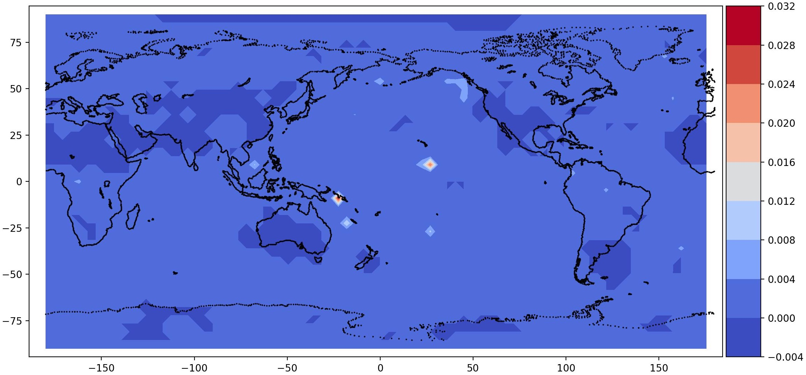 | 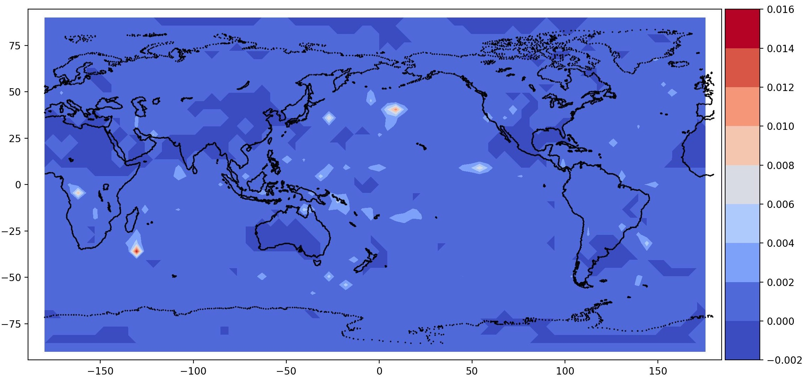
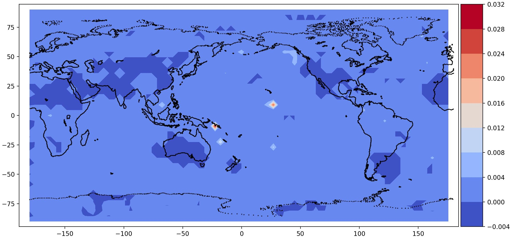 | 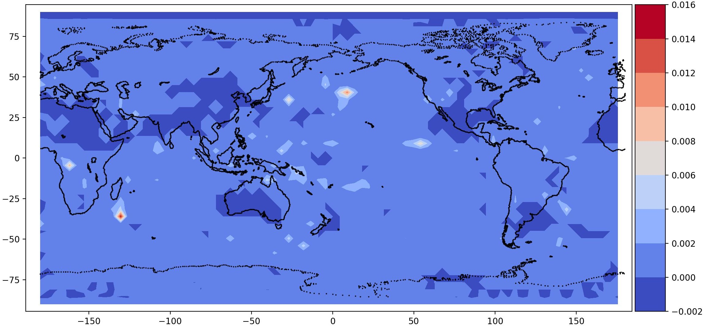
:-------------------------:|:-------------------------:
<span style="color:#858986;"> **Time id 0, true data (top); reconstructed data (bottom)**</span> | <span style="color:#858986;"> **Time id 1, true data (top); reconstructed data (bottom)**</span>

> Note that this step may require some time.


[Go to the Home Page]({{ '/' | absolute_url }})
