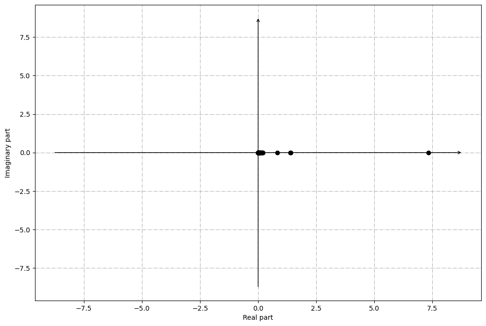
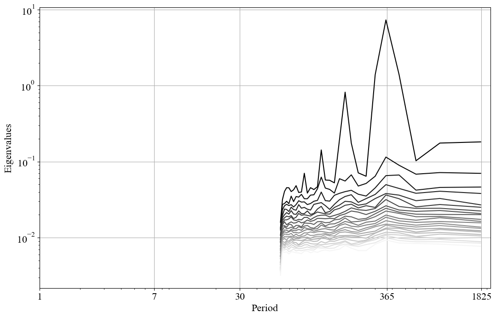
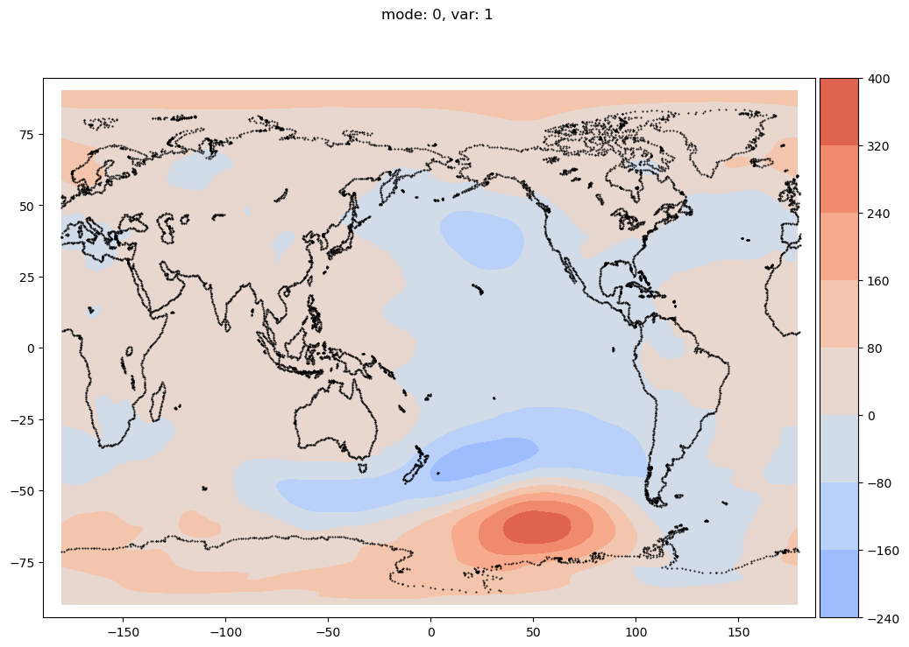
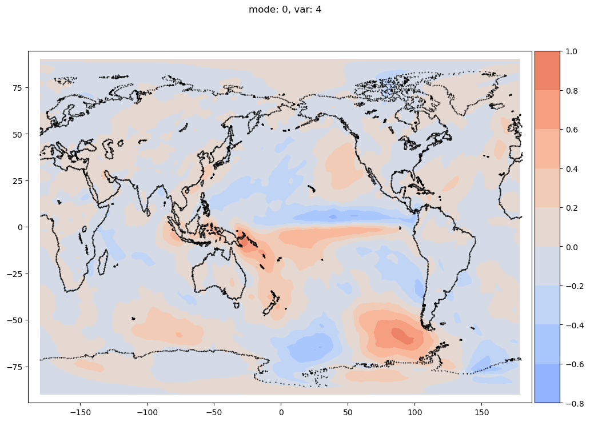
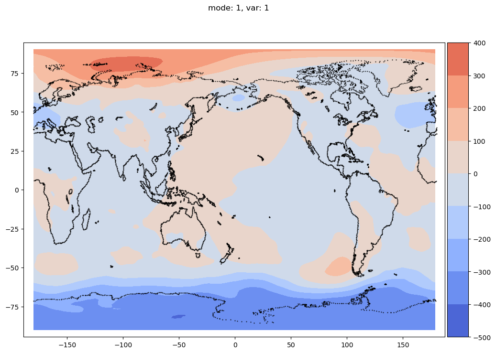
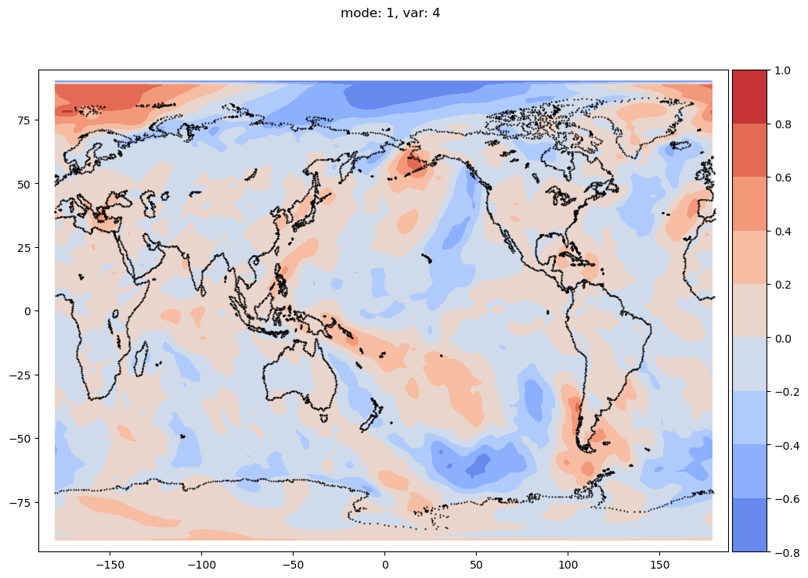
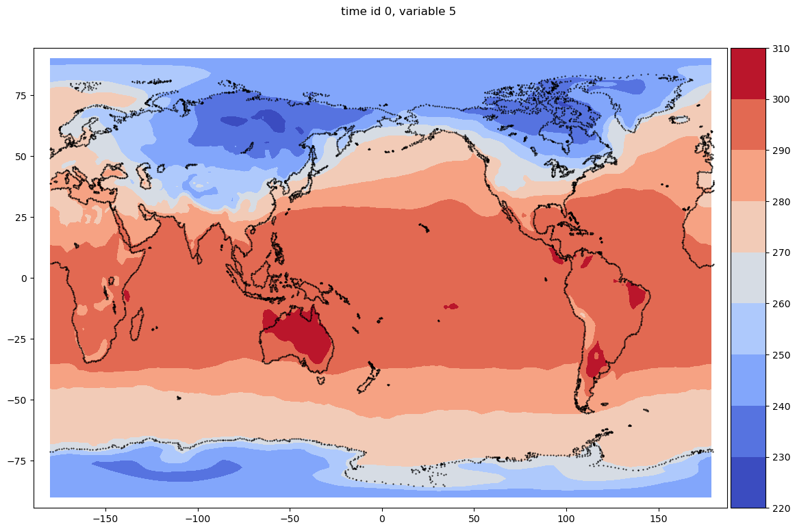
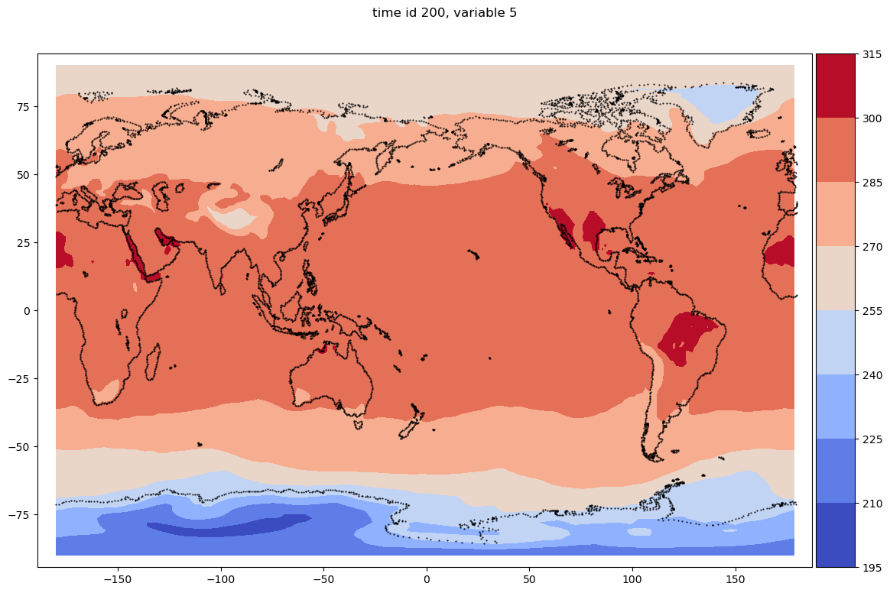

## Preliminaries

For this tutorial:

- To download the required data from ECMWF,
 create an account and follow the instructions [here](https://confluence.ecmwf.int/display/WEBAPI/Access+ECMWF+Public+Datasets).
 A detailed tutorial for downloading data can also be found in **Part 1**

- The complete Python script here [ERA20C_MEI_2D.py ](https://github.com/MathEXLab/PySPOD/blob/main/tutorials/climate/ERA20C_MEI_2D/ERA20C_MEI_2D.py)

## Description
In this tutorial, we will explore the ERA-20C dataset provided by ECMWF. 
In particular, we will reproduce the multivariate ENSO index (MEI) 
that was originally published by [Wolter and Timlin](https://psl.noaa.gov/enso/mei.old/WT1.pdf)
with a seasonally adjusted principal component index, and reproduced by [Schmidt et al](https://flowphysics.ucsd.edu/wp-content/papercite-data/pdf/schmidtetal_2019_mwr.pdf) . 
Multivariate indices, like the MEI index are typically used to reveal interplay 
among different variables. The MEI index is composed of **6 variables**:

- Sea surface temperature (SST)
- Mean sea level pressure (MSL)
- Total cloud cover (TCC)
- Zonal component of the surface wind (U10)
- Meridional component of the surface wind (V10)
- 2-meter temperature (T2M)

We will use the monthly averages of the above variables from 1900 to 2010.

As originally done in the work by Wolter and Timlin, we will:

1. Normalize the data associated to each variable by its total variance
2. Identify spatio-temporal coherent structures by SPOD
3. Associated the modes to the 6 variables considered
4. Make some considerations on the possible interplay among the variables

## 1. Downloading and configuring data

 The first step is downloading data. The data that needs to be downloaded is approximately 443MB. We use an 
 programmatic way to retrieve the data. 
 Please follow the instructions [here](https://confluence.ecmwf.int/display/WEBAPI/Access+ECMWF+Public+Datasets) 
 to create an account.
 Once you have an account to access ECMWF data, 
 you can simply run 
 
```python
 from ecmwfapi import ECMWFDataServer

 server = ECMWFDataServer(url = , key = , email = ) # Fill your key here

 def retrieve_era20c_mnth():
     """
        A function to demonstrate how to iterate efficiently over all months,
        for a list of years of the same decade (eg from 2000 to 2009) for an ERA-20C synoptic monthly means request.
        You can extend the number of years to adapt the iteration to your needs.
        You can use the variable 'target' to organise the requested data in files as you wish.
     """
     yearStart = 1900
     yearEnd = 2010
     monthStart = 1
     monthEnd = 12
     requestMonthList = []
     for year in list(range(yearStart, yearEnd + 1)):
         for month in list(range(monthStart, monthEnd + 1)):
             requestMonthList.append('%04d-%02d-01' % (year, month))
     requestMonths = "/".join(requestMonthList)
     target_sfc = "E20C_MONTHLYMEAN00_1900_2010_MEI.nc"
     era20c_mnth_sfc_request(requestMonths, target_sfc)

 def era20c_mnth_sfc_request(requestMonths, target):
     """
         An ERA era20c request for analysis, sfc data.
         You can change the keywords below to adapt it to your needs.
         (eg add or remove levels, parameters, times etc)
     """
     server.retrieve({
         "class": "e2",
         "stream": "mnth",
         "type": "an",
         "dataset": "era20c",
         "date": requestMonths,
         "expver": "1",
         "param": "34.128/151.128/164.128/165.128/166.128/167.128",
         "levtype": "sfc",
         "target": target,
         "format": "netcdf",
         "grid" : "1.5/1.5",
         "time": "00"
     })
 if __name__ == '__main__':
     retrieve_era20c_mnth()

```
This should download a netCDF file called `E20C_MONTHLYMEAN00_1900_2010_MEI.nc` 
in the current directory `tutorials/climate/ERA20C_MEI_2D/`. If not, please modify it manually.

The next step is to import the required libraries, including the custom libraries

- `from pyspod.spod.standard import Standard as spod_standard`
- `from pyspod.spod.streaming import Streaming as spod_streaming`

that include two different implementations of the SPOD algorithm, 
the first being a standard algorithm, and the second being a streaming algorithm, 
that requires little amount of memory (both storage and RAM) but runs typically 
slower than the standard algorithm.

Note that we also import the custom library

- `import library.weights as weights`

that implements the weight matrix for data defined on a sphere 
(e.g. the atmospheric data we are using).

Therefore, the whole code for importing libraries is

```python
import os
import sys
import time
import warnings
import xarray as xr
import numpy  as np
from pathlib import Path

# Current path
CWD = os.getcwd()

# Import library specific modules
sys.path.insert(0, "../../../")
from pyspod.spod.standard  import Standard  as spod_standard
from pyspod.spod.streaming import Streaming as spod_streaming
import pyspod.utils.weights  as utils_weights
```

We then need to load the data from the netCDF file and inspect:

```python
# Inspect and load data 
file = os.path.join(CWD,'E20C_MONTHLYMEAN00_1900_2010_MEI.nc')
ds = xr.open_dataset(file)
print(ds)
```

Note that the netCDF file contains **3 coordinates**:
- longitude,
- latitude,
- time

along with **6 variables**:

- `sst` (sea surface temperature),
- `msl` (mean seal level pressure),
- `tcc` (total cloud cover),
- `u10` (horizontal velocity; u-component),
- `v10` (horizontal velocity; v-component),
- `t2m` (2-meters temperature).

We first load time, and the two spatial coordinates `longitude` and `latitude`, 
and we store them into three different arrays, `t`, `x1` and `x2`, respectively. 
Let's look at their dimensions to see the number of time snapshots, 
and the length of longitude and latitude.

```python
# we extract time, longitude and latitude
t = np.array(ds['time'])
x1 = np.array(ds['longitude'])
x2 = np.array(ds['latitude'])
nt = t.shape[0]
print('shape of t (time): ', t.shape)
print('shape of x1 (longitude): ', x1.shape)
print('shape of x2 (latitude) : ', x2.shape)
```

We then need to organize the data in a format that is suitable to the PySPOD library, 
that is

- first dimension must correspond to the number of time snapshots (1332 in our case)
- last dimension should corresponds to the number of variables (6 in our case)
- the remaining dimensions corresponds to the spatial dimensions (240, and 121 in our case, 
that correspond to longitude and latitude).

Let's load and reshuffle it, in order to meet this requirement, and check its dimensions.

```python
# we set the variables we want to use for the analysis
# (we select all the variables present) and load them in RAM
variables = ['sst', 'msl', 'tcc', 'u10', 'v10', 't2m']
X = np.empty([t.shape[0], x1.shape[0], x2.shape[0], len(variables)])
for i,var in enumerate(variables):
    X[...,i] = np.einsum('ijk->ikj', np.array(ds[var]))
    X[...,i] = np.nan_to_num(X[...,i])
print('shape of data matrix X: ', X.shape)
```

The outcome should be:

`shape of data matrix X:  (1332, 240, 121, 6)`

<b>NOTE I : we used `np.nan_to_num` to set possible NaN (not-a-number) to zero. 
The amount of NaN in this case is relatively small, and setting them to zero is 
a feasible approximation. For your specific application you might want to apply 
a different replacement for NaN (if present).</b>

<b>NOTE II: we also used `np.einsum` in order to match the axes dimensions 
to the dimensions of the data, i.e. to obtain a matrix shape 1332 &times; 240 &times; 121
</b>

## 2. Setting required and optional parameters

Once our data is in a shape suitable to the PySPOD library, 
we define the required and optional parameters. 
In particular, we define a dictionary of parameters, 
that will be passed to the constructor of PySPOD

The required parameters are as follows:

- `time_step`: time-sampling of the data (for now this must be constant)
- `n_snapshots`: number of time snapshots
- `n_space_dims`: number of spatial dimensions
- `n_variables`: number of variables
- `n_dft`: length of FFT blocks

The optional parameters are as follows:

- `overlap`: dimension of the overlap region between adjacent blocks in percentage (0 to 100)
- `mean_type`: type of mean to be subtracted from the data (longtime, blockwise or zero)
- `normalize_weights`: weights normalization by data variance
- `normalize_data`: normalize data by variance
- `n_modes_save`: number of modes to be saved
- `conf_level`: calculate confidence level of modes
- `reuse_blocks`: whether to attempt reusing FFT blocks previously computed (if found)
- `savefft`: save FFT blocks to reuse them in the future (to save time)
- `savedir`: where to save the data

<b>Note: we used the built-in module `utils_weights`, and in particular the function 
`utils_weights.geo_trapz_2d` to construct the weights for our problem on the sphere. 
This function builds weights according to lon-lat grids on the sphere and 
can be generally used for two-dimensional atmospheric data. 
You can implement your own weights into the custom function inside `utils_weights.py` 
or by readily providing the weights as a `numpy.ndarray`. 

The weights must have a shape equal to the data spatial dimensions number of variables, 
that is:

**weights dim = numbers of spatial dims &times; number of variables**

```python
# define required and optional parameters
params = dict()

# -- required parameters
params['time_step'   ] = 720              # data time-sampling
params['n_snapshots' ] = len(t)           # number of time snapshots (we consider all data)
params['n_space_dims'] = 2                # number of spatial dimensions (longitude and latitude)
params['n_variables' ] = len(variables)   # number of variables
params['n_dft'       ] = np.ceil(12 * 5)  # length of FFT blocks (100 time-snapshots)

# -- optional parameters
params['overlap'          ] = 0             # dimension block overlap region
params['mean_type'        ] = 'blockwise'   # type of mean to subtract to the data
params['normalize_weights'] = True          # normalization of weights by data variance
params['normalize_data'   ] = False         # normalize data by data variance
params['n_modes_save'     ] = 3             # modes to be saved
params['conf_level'       ] = 0.95          # calculate confidence level
params['reuse_blocks'     ] = False         # whether to reuse blocks if present
params['savefft'          ] = False         # save FFT blocks to reuse them in the future (saves time)
params['savedir'          ] = os.path.join(CWD, 'results', Path(file).stem) # folder where to save results

# Set weights
weights = utils_weights.geo_trapz_2D(
	x1_dim=x2.shape[0], x2_dim=x1.shape[0],
	n_vars=len(variables), R=1)
```

Note that for this tutorial we normalize the weights by data variance by setting 
`params['normalize_weights'] = True`. 
This step is performed as in (Wolter and Timlin, 1993) and (Schmidt et al., 2019).

## 3. Running the SPOD analysis

This step is accomplished by calling the PySPOD constructor, `spod_standard(params=params, weights=weights)` 
and the fit method, `SPOD_analysis.fit(data_list=X)`.

- The PySPOD constructor takes the parameters `params`, and `weights`.

- The method `fit` takes as inputs `data_list`, that can either be a `numpy.ndarray` 
containing the data or a list of `xarray.DataArrays`.

- The `fit` method returns a PySPOD object containg the results.

```python
# Perform SPOD analysis using the standard module
SPOD_analysis = spod_standard(
	params=params,
	weights=weights)

# Fit SPOD
spod = SPOD_analysis.fit(data_list=X)
```
## 4. Postprocessing and visualizing results

The results are stored in a PySPOD object that is composed by:

- A set of eigenvalues per each frequency computed,

- A set of modes, per each frequency computed.

In order to visualize them, we can use the built-in plotting functionalities of PySPOD. 
We first select the frequency (equivalently period `T_approx`), that we want to investigate, 
and identify the nearest frequency in the results by using the built-in functions `find_nearest_freq`, 
and `get_modes_at_freq`, that are part of the `postproc` module, 
and can be directly called from the PySPOD object returned once the `fit` method has completed.

```python
# Show results
T_approx = 876 # approximate period (in days)
freq_found, freq_idx = spod.find_nearest_freq(freq_req=1/T_approx, freq=spod.freq)
modes_at_freq = spod.get_modes_at_freq(freq_idx=freq_idx)
```

We can then plot the eigenvalues in the complex plane, 
using the built-in function `plot_eigs`, that is part of the `postproc` module. 


```python
spod.plot_eigs()
```

We note that the eigenvalues are all real.

We can then plot the eigenvalues as a function of frequency or period 
(note that we multiply the frequency by 24, that is the number of hours in a day, 
to obtain a period for the x-axis in days). Again, we can see how thorough the 
PySPOD object returned after the computation we can access the frequency array (spod.freq) 
along with the plotting methods `spod.plot_eigs_vs_frequency` and `spod.plot_eigs_vs_period`.

Here, the `xticks` we use in Eigenvalues vs period polt represents day, week, month, year and 5 years respectively.

```python
freq = spod.freq*24
spod.plot_eigs_vs_frequency(freq=freq)
spod.plot_eigs_vs_period(freq=freq, xticks=[1, 7, 30, 365, 1825])
```

 | 
:-------------------------:|:-------------------------:
<span style="color:#858986;"> **Eigenvalues**</span> | <span style="color:#858986;"> **Eigenvalues vs period**</span>

We can then plot the modes that were computed by the SPOD algorithm via the 
built-in `plot_2d_modes_at_frequency` method, that can again be accessed via the 
PySPOD object returned after the computation. 

To this method, we pass 
the frequency of the modes we are interested in. This corresponds to the frequency 
associated to the `T_approx` of 876 days that we requested, and stored in the variable 
`freq_found` that we calculated above. Note that we also pass the `vars_idx` corresponding 
to the variable we are interested in, `modes_idx` corresponding to the modes we are interested in, 
as well as `x1`, and `x2`, that correspond to `longitude` and `latitude`. 

We finally pass a parameter `coastlines='centred'`, that overlays a world map 
on top of our data. Note that we shift longitude of 180, as we use coastlines that 
goes from -180, to 180, while our data was provided from 0 to 360.

```python
spod.plot_2d_modes_at_frequency(
    freq_req=freq_found, 
    freq=freq, 
    x1=x1-180, 
    x2=x2, 
    coastlines='centred', 
    modes_idx=[0,1], 
    vars_idx=[1,4])
```

 | 
:-------------------------:|:-------------------------:
<span style="color:#858986;"> **Mode 0, variable 1 (msl)**</span> | <span style="color:#858986;"> **Mode 0, variable 4 (v10)**</span>

 | 
:-------------------------:|:-------------------------:
<span style="color:#858986;"> **Mode 1, variable 1 (msl)**</span> | <span style="color:#858986;"> **Mode 1, variable 4 (v10)**</span>

Note that we can also plot the **original data** by

```python
data = spod.get_data(X)

spod.plot_2d_data(
    data,
    x1=x1-180, 
    x2=x2, 
    coastlines='centred', 
    vars_idx=[5], 
    time_idx=[0,200])

```

 | 
:-------------------------:|:-------------------------:
<span style="color:#858986;"> **Time 0, variable 5 (t2m)**</span> | <span style="color:#858986;"> **Time 0, variable 5 (t2m)**</span>


## 5. Final notes

The results are stored in the results folder defined in the parameter you specified 
under `params['savedir']`. You can load the results for both modes and eigenvalues, 
and use any other postprocessing tool that is more suitable to your application. 

The files are stored in numpy binary format `.npy`. 

There exist several tools to convert them in netCDF, MATLAB and several other formats 
that can be better suited to your specific post-processing pipeline.

This tutorial was intended to help you setup your own multivariate case. 

You can play with the parameters we explored above to gain more insights into the 
capabilities of the library.